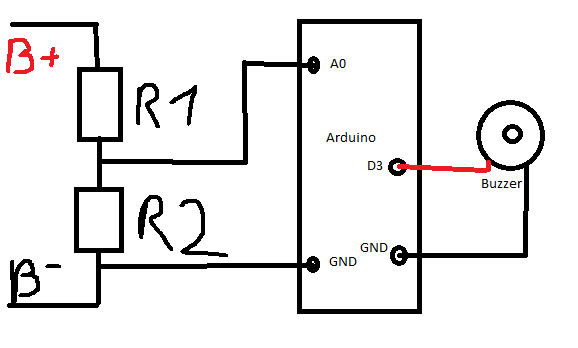

# Arduino Battery Watchdog
## What it does
This code will measure the voltage at + - of a battery and and warn with a buzzer when certain per cell voltages are reached

## What you need

First you need to make a voltage divider specifically for you application. In my case, I use R1 = 50kOhm and R2 = 4.96kOhm giving me a divder value of about 11.

I use these ressistances because I want to watch the voltage of a 10s lipo battery that has a V range of 33V-42V.

I then mesure the Voltage across R2 with the pin A0.

Second you need a 5V buzzer that will be the feedback. I've got mine from an old PC motherboard, no idea what model.

# Schematics

Just solder R2 between A0 and GND. And also the buzzer is between D3 and GND.

# Settings

Read the comments in the code. I have tried to explain everything there. Feel free to contact me if you have any questions

# Warinings

I take no responsibility if anything goes wrong. Use at your own risks.
The mesured cell voltage is only an average across all cells. If you have dead cell, this will not detect it/warn you.